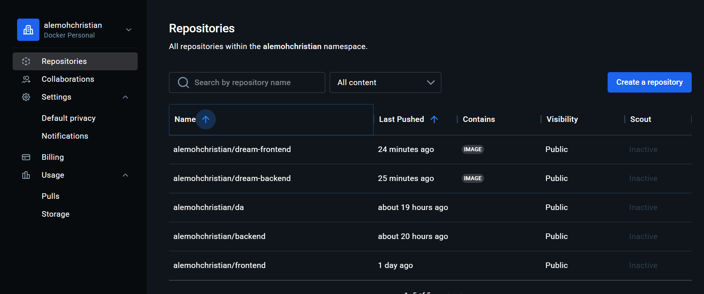
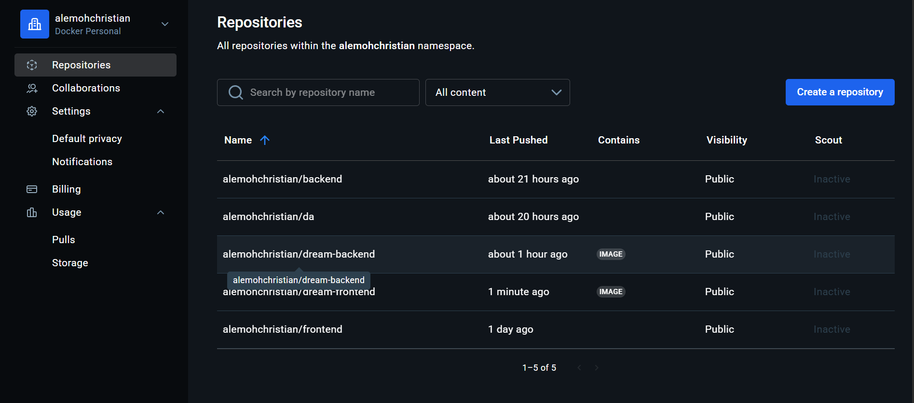

# Dream Vacation App

🚀 **Dream Vacation App** is a full-stack web application that allows users to plan and organize their dream vacations. The project consists of a **React frontend** and a **Node/Express backend**, both running in Docker containers for easy development and deployment.

## Features

- Submit vacation plans through a user-friendly form.
- Backend API handles and stores user submissions.
- Frontend communicates seamlessly with backend using environment-based URLs.
- Fully containerized for consistent development and deployment.

## Tech Stack

- **Frontend:** React, Axios, JavaScript, HTML, CSS
- **Backend:** Node.js, Express, MongoDB (or your database)
- **Containerization:** Docker, Docker Compose

## Screenshots

### git action success

### docker repo succes

## Running the Project

